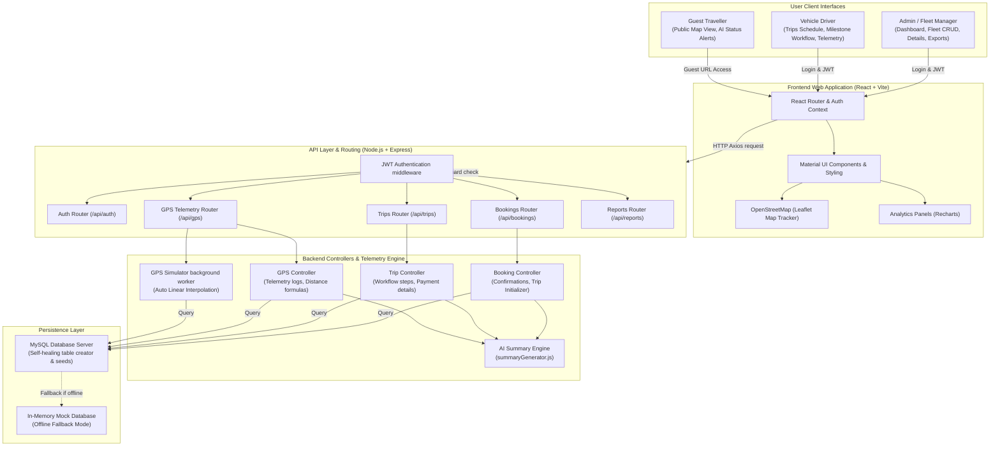

# Standalone System Architecture Diagram

This document illustrates the three-tier system architecture designed for the **Manivtha Travels GPS-Based Trip Tracking Dashboard**.

---

## Architecture Diagram (Mermaid)

---

## Structural Workflow Sequence

1. **Booking Confirmation**: Admin confirms booking $\rightarrow$ Booking Controller allocates vehicle and driver $\rightarrow$ inserts trip record and logs milestone `Booking Created` inside `trip_history`.
2. **Ride Dispatch**: Driver marks trip status `Dispatched` $\rightarrow$ Trip Controller triggers notification $\rightarrow$ activates background GPS Coordinate Simulator.
3. **Telemetry Logs**: Background GPS Simulator ticks every 10 seconds $\rightarrow$ moves coordinates linearly $\rightarrow$ inserts logs in `gps_logs` $\rightarrow$ evaluates ETA delays $\rightarrow$ logs alerts.
4. **Detail Analytics**: Admin opens Detailed Statistics Page $\rightarrow$ Trip controller pulls customer, driver, vehicle, payments ledger, complaints, star ratings, workflow steps, coordinates timeline $\rightarrow$ passes summaries through `summaryGenerator.js` $\rightarrow$ outputs dynamic JSON payload to client dashboard.
