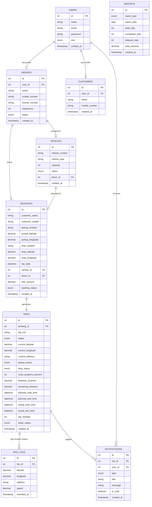

# Entity Relationship (ER) Diagram

This document contains the visual representation of the **Manivtha Travels** database schema.

---

## Mermaid ER Diagram

---

## Relational Constraints & Schema Details

1. **`users` ➔ `drivers`**
   - **Type**: 1-to-1 Relationship (Optional). A user record with the role `driver` is linked to a unique entry in the `drivers` table via `user_id`.
   - **Constraint**: `FOREIGN KEY (user_id) REFERENCES users(id) ON DELETE SET NULL`.

2. **`drivers` ➔ `vehicles`**
   - **Type**: 1-to-1 Relationship (Optional). Represents the default vehicle assignment.
   - **Constraint**: `FOREIGN KEY (driver_id) REFERENCES drivers(id) ON DELETE SET NULL` with a `UNIQUE` index on `driver_id`.

3. **`bookings` Relationships**
   - A booking is linked to **`vehicles`** and **`drivers`** to represent the scheduled vehicle and driver.
   - **Constraints**: 
     - `FOREIGN KEY (vehicle_id) REFERENCES vehicles(id) ON DELETE SET NULL`
     - `FOREIGN KEY (driver_id) REFERENCES drivers(id) ON DELETE SET NULL`

4. **`bookings` ➔ `trips`**
   - **Type**: 1-to-1 Relationship (Strict). Every confirmed booking triggers exactly one ride trip record in the database for GPS coordinate tracking.
   - **Constraint**: `FOREIGN KEY (booking_id) REFERENCES bookings(id) ON DELETE CASCADE` with a `UNIQUE` index on `booking_id`.

5. **`trips` ➔ `gps_logs`**
   - **Type**: 1-to-Many Relationship. As the GPS coordinate simulator increments coordinates, it appends data logs to `gps_logs` mapping the path history.
   - **Constraint**: `FOREIGN KEY (trip_id) REFERENCES trips(id) ON DELETE CASCADE`.
